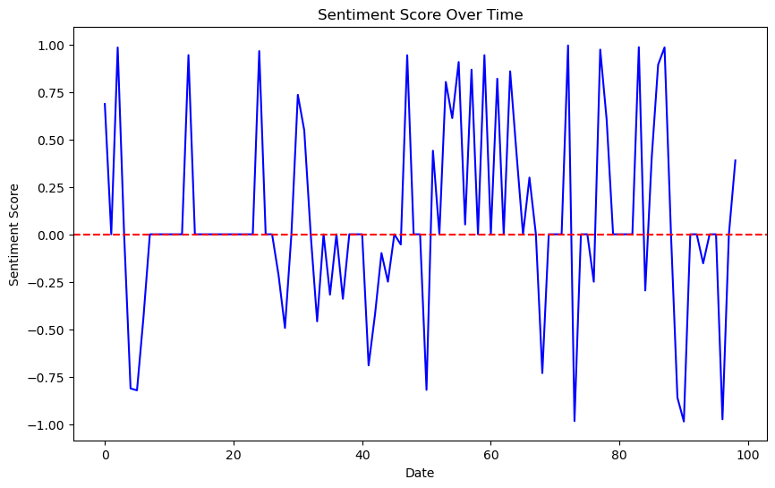
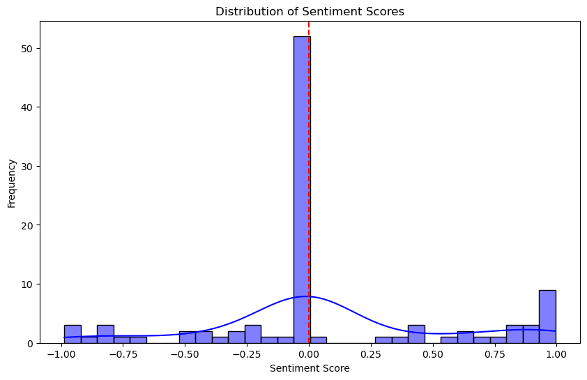
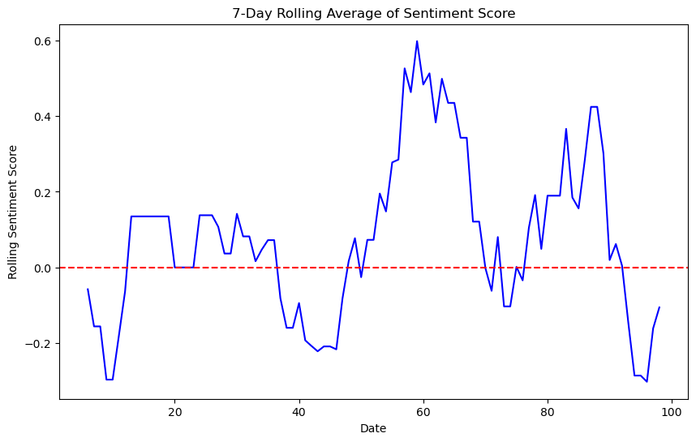
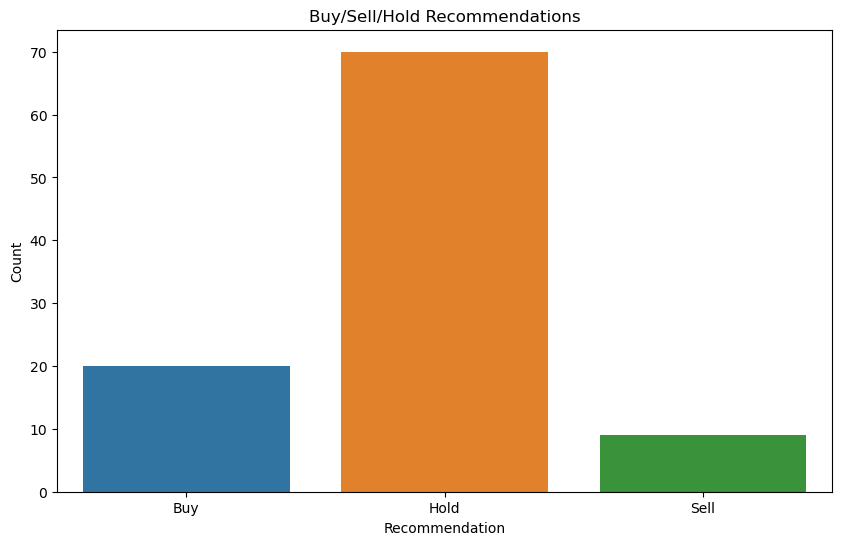
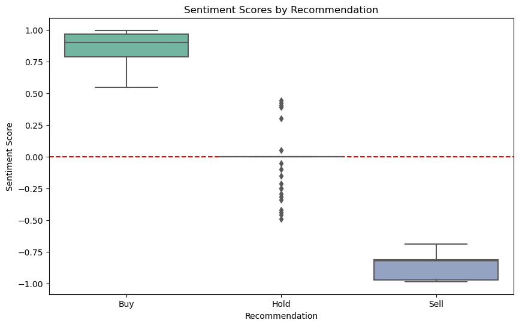

# WallStreetBets Sentiment Analysis — Reddit API

Scrapes r/wallstreetbets posts via the Reddit API, applies NLP sentiment scoring to derive Buy/Hold/Sell signals, and produces 6 visualisations showing how retail investor sentiment evolves over time and correlates with trading recommendations.

---

## Table of Contents
- [Project Overview](#project-overview)
- [Data Collection](#data-collection)
- [Sentiment Analysis Pipeline](#sentiment-analysis-pipeline)
- [Results & Visualisations](#results--visualisations)
- [Trading Signal Logic](#trading-signal-logic)
- [How to Run](#how-to-run)
- [Files](#files)

---

## Project Overview

r/wallstreetbets (12M+ members) is one of the most influential retail investor communities. Post sentiment on WSB has demonstrably moved stock prices (GameStop, AMC, etc.). This project quantifies that sentiment at scale:

1. **Scrape** post titles, content, upvotes, and downvotes via Reddit API
2. **Score** each post with NLP sentiment analysis
3. **Classify** into Buy / Hold / Sell signals based on score thresholds
4. **Visualise** temporal patterns, score distributions, and signal-sentiment correlations

---

## Data Collection

**API:** Reddit API via `requests` and JSON parsing (no PRAW dependency)

**Fields collected per post:**

| Field | Description |
|-------|------------|
| `title` | Post title |
| `selftext` | Post body content |
| `upvote_ratio` | Ratio of upvotes to total votes |
| `ups` | Total upvotes |
| `downs` | Total downvotes |
| `stock_mentions` | Tickers mentioned in post (regex extraction) |

Data cleaned: null values removed, irrelevant columns dropped → exported to `output.csv`.

---

## Sentiment Analysis Pipeline

```
Reddit API (r/wallstreetbets)
        │
        ▼
Post Scraping (requests + JSON)
→ Raw posts: title, body, upvotes, downvotes
        │
        ▼
Text Preprocessing (nltk)
  ├── Tokenisation
  ├── Stop-word removal
  └── Lemmatisation
        │
        ▼
Sentiment Scoring (NLTK / VADER-style)
→ Score ∈ [−1, 1]
        │
        ▼
Signal Classification
  ├── Score > 0.5  → Buy
  ├── Score < −0.5 → Sell
  └── Otherwise    → Hold
        │
        ▼
Visualisation (matplotlib + seaborn)
→ 6 charts + sentiment_analysis_report.md
```

---

## Results & Visualisations

### Summary Statistics

| Metric | Value |
|--------|-------|
| Average Sentiment Score | **0.08** (slightly positive overall) |
| Median Sentiment Score | **0.00** (neutral median) |
| Buy signals | 20 posts |
| Hold signals | 70 posts |
| Sell signals | 9 posts |

### Sentiment Score Over Time



High volatility in individual post scores — scores swing from −1 to +1 day-to-day. Red line marks neutral (0).

### Sentiment Score Distribution



Bimodal distribution: a spike at 0 (neutral posts) and a secondary peak near +1. The community skews toward strongly positive sentiment, with a long left tail of strongly negative posts.

| Score Range | Interpretation | Frequency |
|-------------|---------------|-----------|
| 0.5 to 1.0 | Strongly positive (Buy zone) | ~20% |
| −0.1 to 0.1 | Neutral | ~45% |
| −1.0 to −0.5 | Strongly negative (Sell zone) | ~9% |
| All others | Mixed sentiment (Hold zone) | ~26% |

### 7-Day Rolling Average



Rolling average smooths noise and reveals regime shifts — sustained positive periods (bullish runs) followed by sharp negative dips correlating with market events.

### Buy/Sell/Hold Distribution



| Signal | Count | Share |
|--------|-------|-------|
| Buy | 20 | ~20% |
| Hold | 70 | ~70% |
| Sell | 9 | ~9% |

70% of posts fall in the Hold zone — consistent with WSB's chaotic mix of DD posts, memes, and loss porn.

### Sentiment by Recommendation (Box Plot)



| Signal | Median Score | Score Range | Interpretation |
|--------|-------------|-------------|---------------|
| Buy | ~0.85 | 0.5 to 1.0 | Tight cluster of strongly positive posts |
| Sell | ~−0.90 | −1.0 to −0.5 | Tight cluster of strongly negative posts |
| Hold | ~0.00 | −0.5 to 0.5 | Full spread — genuinely mixed community sentiment |

Strong separation: Buy posts cluster at 0.8–1.0, Sell posts at −0.85 to −1.0, Hold posts cover the full range.

---

## Trading Signal Logic

```python
if sentiment_score > 0.5:
    signal = "Buy"
elif sentiment_score < -0.5:
    signal = "Sell"
else:
    signal = "Hold"
```

**Key finding:** Positive sentiment reliably predicts Buy sentiment clusters; negative sentiment predicts Sell clusters. The Hold zone contains genuinely mixed/uncertain community sentiment.

---

## How to Run

```bash
git clone https://github.com/aguru-venkata-saisantosh-patnaik/Data_Analysis_on_wallstreetbets_using_redditAPI.git
cd Data_Analysis_on_wallstreetbets_using_redditAPI
pip install pandas numpy matplotlib seaborn nltk requests
```

**Reddit API Setup:**
1. Create a Reddit app at [reddit.com/prefs/apps](https://www.reddit.com/prefs/apps) (script type)
2. Set `client_id`, `client_secret`, `user_agent` in the scraping notebook

**Run notebooks in order:**
1. `reddit_wallstreetbets_scrapper.ipynb` — scrape posts → `output.csv`
2. `Visualisation and Report.ipynb` — sentiment scoring, classification, and all charts

---

## Files

| File | Description |
|------|------------|
| [`reddit_wallstreetbets_scrapper.ipynb`](reddit_wallstreetbets_scrapper.ipynb) | Reddit API scraper → CSV |
| [`Visualisation and Report.ipynb`](Visualisation%20and%20Report.ipynb) | NLP analysis, signal classification, 6 visualisations |
| [`output.csv`](output.csv) | Scraped and cleaned dataset |
| [`sentiment_analysis_report.md`](sentiment_analysis_report.md) | Auto-generated summary report |
| [`Data_Analysis_on_wallstreetbets_using_redditAPI_Report.pdf`](Data_Analysis_on_wallstreetbets_using_redditAPI_Report.pdf) | Full PDF report |

---

## About

**Aguru Venkata Saisantosh Patnaik** — NLP & Financial Sentiment Analysis  
Contact: [agurusantosh@gmail.com](mailto:agurusantosh@gmail.com)
